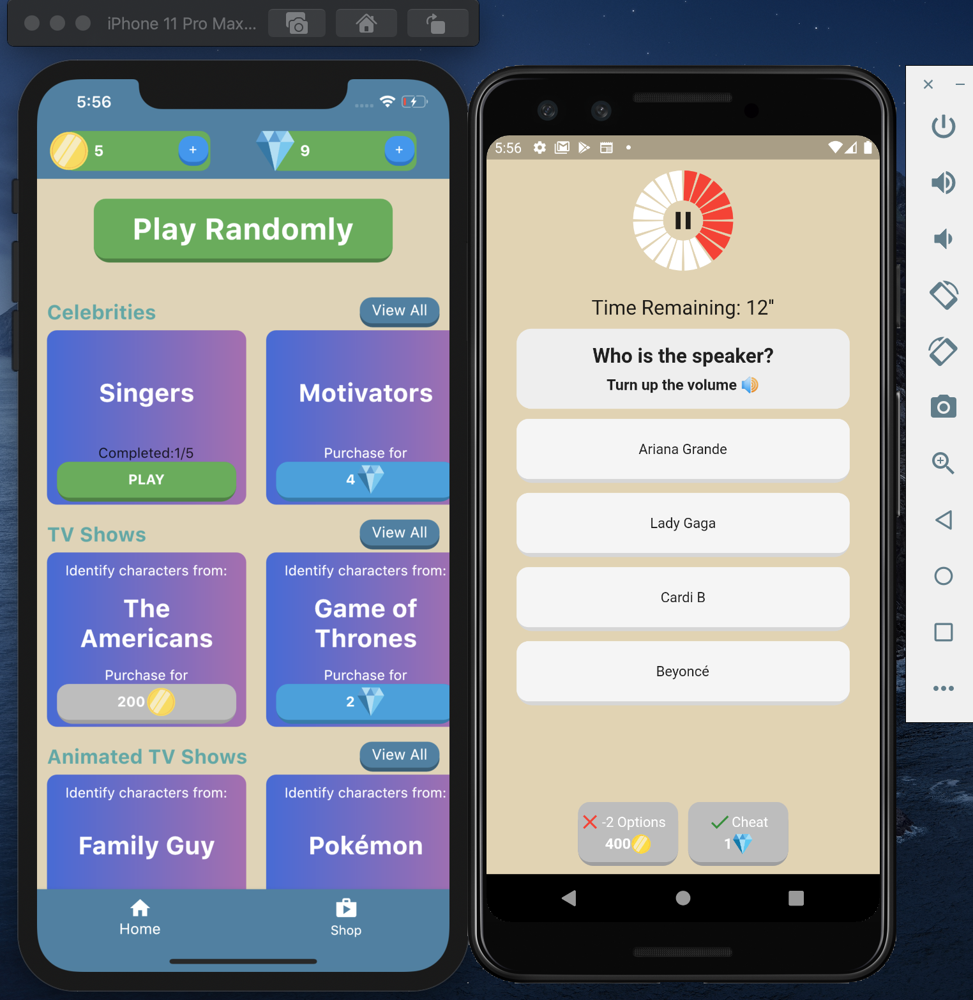

# Trivia: Voice Recognition Trainer

An interactive trivia game that test your vocal recognition abilities.

Bugs/fixes can be submitted to til.baniya@gmail.com.

## Author
Til Baniya

## Your role in this game: 
You will listen to a random voice clip of a celebrity, then you will identify the celebrity.

But wait, there more! Try it out.

## Screenshot:

## How to run this program?

1. Install Android Studio and Flutter. This video may be helpful: https://youtu.be/hL7pkX1Pfko
2. Install Android or IOS emulator, or both. You can also install it right on your phone without having to download emulators. --This app works on both Android and IOS.
3. Install required packages by running the command "flutter pub get" on your Android Studio Terminal or go to pubspec.yaml file then click the "pub get" button.
4. Run.

